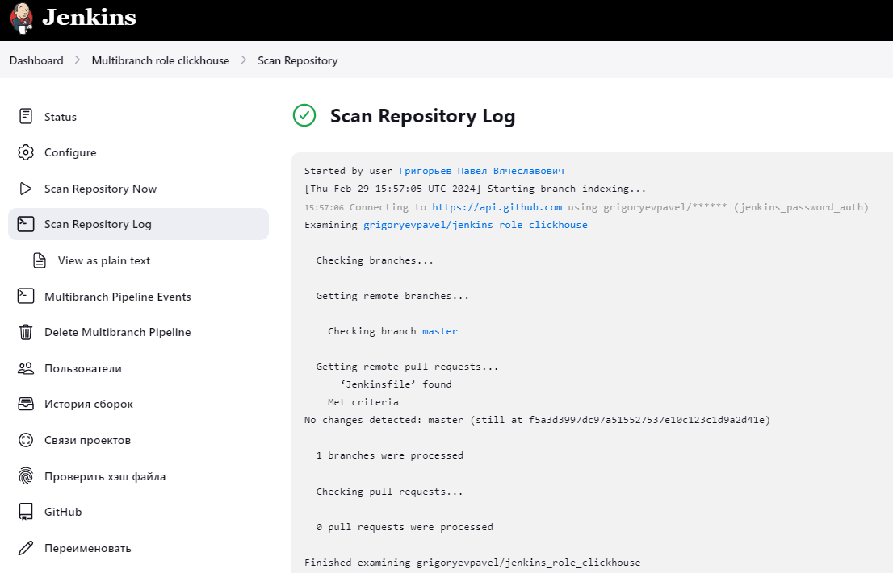

## Название

Jenkins Declarative Pipeline и Jenkins Script Pipeline

## Описание

Файлы декларативных конвейеров расположены в папке roles_defs. Фактически создано два конвейера:
- jenkins_role_clickhouse
- jenkins_role_nginx

Файл декларативного конвейера для clickhouse роли расположен в **[Jenkinsfile](roles_defs/jenkins_role_clickhouse/Jenkinsfile)**
Файл декларативного конвейера для nginx роли расположен в **[Jenkinsfile](roles_defs/jenkins_role_nginx/Jenkinsfile)**

Скриптовой конвейер переделан и итоговый файл скриптового конвейера находится в файле **[ScriptedJenkinsfile](ScriptedJenkinsfile)**
В папке playbooks находится плейбук который выполняет скриптовой конвейер.

## Результаты работы конвейеров

1. Декларативный конвейер:

2. Скриптовой конвейер:

